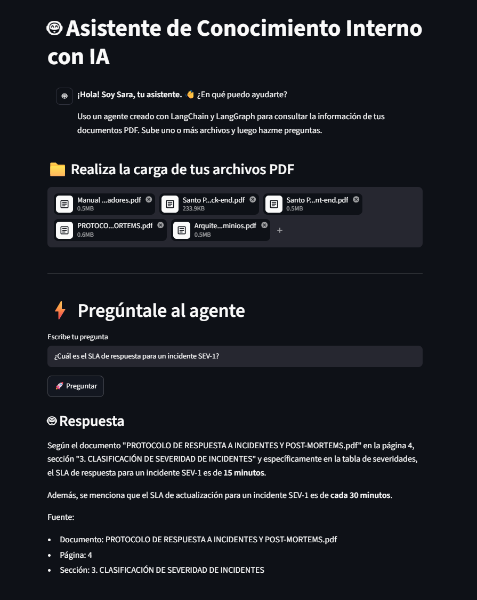

# Sara — Asistente de Conocimiento Interno con IA

Sara es un agente de IA tipo **RAG (Retrieval-Augmented Generation)** que responde preguntas basándose exclusivamente en la información contenida en documentos PDF internos de una empresa (manuales de onboarding, protocolos, guías técnicas, políticas, etc.).

El usuario sube uno o más PDF, el sistema los procesa y crea una base de conocimiento vectorial, y luego se puede conversar con el agente para consultar esa información de forma natural, con respuestas que citan el documento y la página de origen.

## ¿Cómo funciona?

1. **Carga de documentos** — el usuario sube uno o más archivos PDF desde la interfaz de Streamlit.
2. **Procesamiento (pipeline RAG)** — los documentos se dividen en fragmentos (*chunks*), se convierten en *embeddings* y se almacenan en una base de datos vectorial.
3. **Recuperación** — cuando el usuario hace una pregunta, el agente busca los fragmentos más relevantes dentro de esa base.
4. **Generación** — un modelo de lenguaje redacta la respuesta usando únicamente la información recuperada, indicando el documento y la página de donde proviene.

## Tecnologías utilizadas

| Componente | Tecnología |
|---|---|
| Orquestación del agente | LangChain + LangGraph |
| Modelo de lenguaje (LLM) | Groq (`llama-3.3-70b-versatile`) |
| Embeddings | Cohere (`embed-multilingual-v3.0`) |
| Base de datos vectorial | ChromaDB |
| Carga de PDF | PyMuPDF |
| Interfaz | Streamlit |
| Memoria de conversación | LangGraph `MemorySaver` |

##  Ejemplos de preguntas y respuestas

Los siguientes ejemplos fueron generados usando el *Manual de Onboarding para Nuevos Desarrolladores* y el *Protocolo de Respuesta a Incidentes y Post-Mortems* como base de conocimiento. Reemplaza estos ejemplos por capturas reales de tu aplicación corriendo.

**Pregunta:** ¿Cuál es el SLA de respuesta para un incidente SEV-1?
**Respuesta de Sara:**
Según el documento "PROTOCOLO DE RESPUESTA A INCIDENTES Y POST-MORTEMS.pdf" en la página 4, sección "3. CLASIFICACIÓN DE SEVERIDAD DE INCIDENTES" y específicamente en la tabla de severidades, el SLA de respuesta para un incidente SEV-1 es de 15 minutos.
Además, se menciona que el SLA de actualización para un incidente SEV-1 es de cada 30 minutos.

Fuente:
Documento: PROTOCOLO DE RESPUESTA A INCIDENTES Y POST-MORTEMS.pdf
Página: 4
Sección: 3. CLASIFICACIÓN DE SEVERIDAD DE INCIDENTES

**Pregunta:** ¿Qué debo hacer el primer día para obtener acceso a GitHub?
**Respuesta de Sara:**
Según el documento "Manual de Onboarding para Nuevos Desarrolladores.pdf" en la página 6, sección "Antes del Día 1" y "Día 1 — primeras 2h", el acceso a GitHub se solicita de la siguiente manera:

El acceso a GitHub es proporcionado por el Tech Lead de tu Chapter.
Debes pedirle el acceso directamente por Slack en el mismo Día 1.
Es importante mencionar que, según la sección 3.3 "Procedimiento para Solicitar Accesos" en la página 7, para accesos que dependen del Tech Lead, como GitHub, debes pedírselo directamente por Slack en el mismo Día 1.

Referencia:
Documento: Manual de Onboarding para Nuevos Desarrolladores.pdf
Página: 6 y 7
Sección: Antes del Día 1, Día 1 — primeras 2h y 3.3 Procedimiento para Solicitar Accesos

**Pregunta:** ¿Cuál es la cobertura mínima de pruebas unitarias exigida?
**Respuesta de Sara:**
La cobertura mínima de pruebas unitarias es del 80%. Esto se establece en la Guía Oficial de Ingeniería Back-end (Página 12) y en la Guía Oficial de Ingeniería Front-end (Página 21), y se verifica automáticamente en el pipeline de CI/CD.

Fuente: Guía Oficial de Ingeniería Back-end.pdf, Página 12, Sección 10 - Estrategia y Cobertura de Pruebas
Fuente: Guía Oficial de Ingeniería Front-end.pdf, Página 21, Sección 10 - Estrategia y Cobertura de Pruebas
Fuente: Manual de Onboarding para Nuevos Desarrolladores.pdf, Página 13, Sección de Verificación de Cobertura
Es importante destacar que la cobertura mínima del 80% es obligatoria y el build falla si la cobertura cae por debajo de este umbral.

**Pregunta:** ¿Qué es el Error Budget y cómo se calcula?
**Respuesta de Sara:**
Según el documento "PROTOCOLO DE RESPUESTA A INCIDENTES Y POST-MORTEMS.pdf" en la página 30 y 31, se define el Error Budget como:

La cantidad máxima de indisponibilidad o degradación que Santo Pegasus puede "gastar" en un período determinado (normalmente mensual) sin violar el SLO establecido.
Un mecanismo que define el equilibrio entre la velocidad de entrega de nuevas funcionalidades y la necesidad de mantener la estabilidad del sistema.
Cálculo del Error Budget

La fórmula base para calcular el Error Budget es:

Error Budget (%) = 100% - SLO (%)
Para el servicio Agendio, con un SLO de Disponibilidad del 99.9%, el cálculo sería:

Error Budget Mensual (%) = 100% - 99.9% = 0.1%
Minutos en un mes (30 días) = 30 × 24 × 60 = 43.200 minutos
Error Budget Mensual (minutos) = 43.200 × 0.001 = 43,2 minutos
Esto significa que el servicio Agendio puede estar indisponible por un máximo de 43 minutos por mes antes de que el SLO sea violado.

Cálculo del Error Budget consumido en un incidente
La fórmula para calcular el Error Budget consumido en un incidente es:

Budget Consumido = Duración del Incidente × % de Usuarios Afectados
Ejemplo: Un incidente de 20 minutos que afecta al 100% de los usuarios consume 20 minutos del Error Budget. Un incidente de 60 minutos que afecta al 50% de los usuarios consume 30 minutos del Error Budget.

Referencia
Documento: PROTOCOLO DE RESPUESTA A INCIDENTES Y POST-MORTEMS.pdf
Página: 30 y 31
Sección: 13. ERROR BUDGET: DEFINICIÓN, CÁLCULO Y POLÍTICA DE AGOTAMIENTOstreamlit run app.py

## Cómo correr el proyecto

**1. Clonar el repositorio**
```bash
git clone <URL-de-tu-repositorio>
cd <nombre-del-proyecto>
```

**2. Crear un entorno virtual (recomendado)**
```bash
python -m venv venv
source venv/bin/activate      # macOS/Linux
venv\Scripts\activate         # Windows
```

**3. Instalar las dependencias**
```bash
pip install -r requirements.txt
```

**4. Configurar las variables de entorno**

Crea un archivo `.env` en la raíz del proyecto con tus claves de API:
```env
GROQ_API_KEY=tu_api_key_de_groq
COHERE_API_KEY=tu_api_key_de_cohere
```

**5. Ejecutar la aplicación**
```bash
streamlit run app.py
```

La aplicación se abrirá automáticamente en `http://localhost:8501`.

**6. Usarla**
- Sube uno o más archivos PDF desde la interfaz.
- Espera a que el agente termine de procesarlos.
- Escribe tu pregunta y presiona " Preguntar".

## Demo

**Enlace a la aplicación:** _(agregar aquí)_

**Captura de pantalla:**


